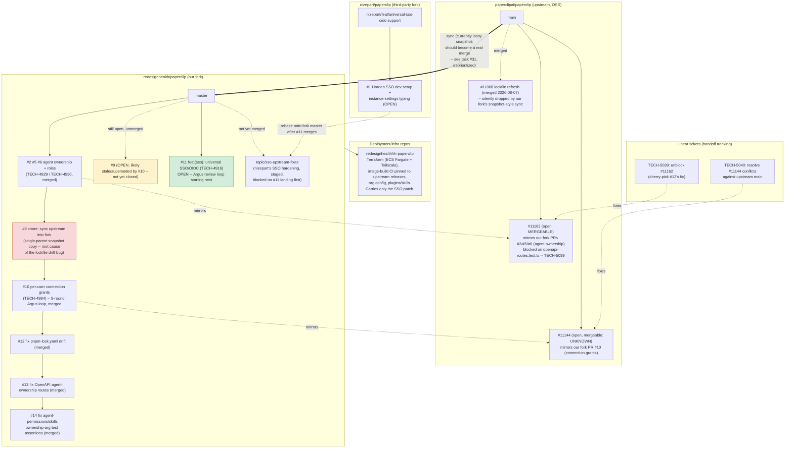

# Paperclip fork/branch topology

Snapshot as of 2026-08-10, reflecting the state after PR #10's Argus review loop
and the two follow-up fixes (#12 lockfile, #13 OpenAPI, #14 test assertions) merged.

## Notes

- **Fork sync is currently lossy.** `#8` (the fork's most recent "sync upstream" commit) has a single parent, meaning it's a snapshot copy of upstream's tree rather than a real `git merge` preserving upstream's commit graph. This is why `#11068` (an upstream lockfile fix that merged *before* `#8`'s sync commit) never actually landed in the fork -- confirmed by `git merge-base --is-ancestor`. See task/ticket for a future fix (deprioritized for now -- see conversation).
- **`#9` looks stale.** It's an earlier, unmerged draft of the same connection-grants work that shipped as `#10`. Never closed. Worth closing manually to avoid confusion.
- **Two upstream mirror PRs are open and blocked**, each with its own fix identified and ticketed for another agent to pick up (`TECH-5039`, `TECH-5040`) rather than resolved directly in this session.
- **`nizepart/paperclip#1`** is deliberately sequenced *after* `#11` (our own SSO PR) lands, to avoid wasted rebase conflicts on the same code.
- **`rh-paperclip`** is a separate deployment/infra repo (Terraform + image-build CI), not a code fork -- it only carries the SSO patch reference, no app code fork of its own.
